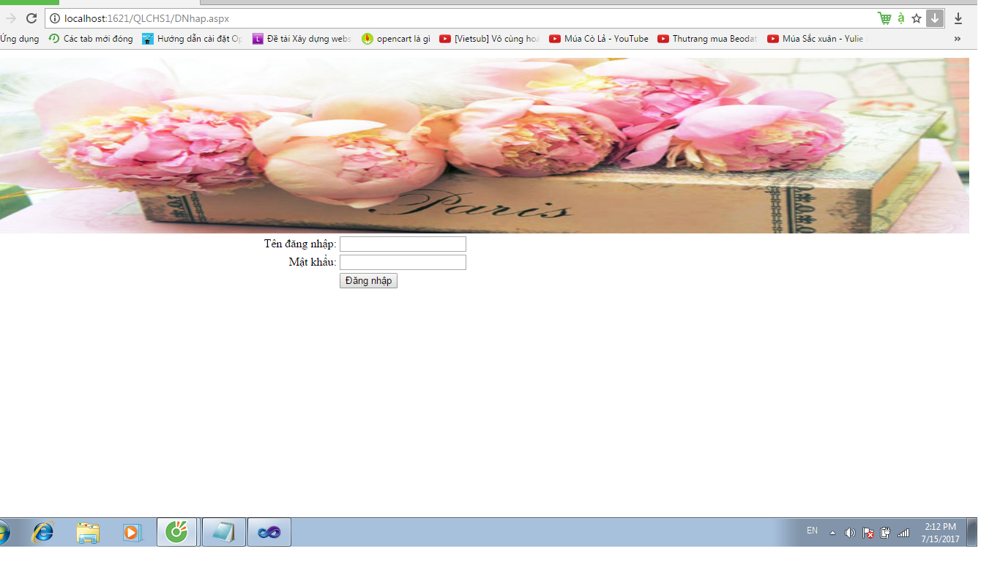
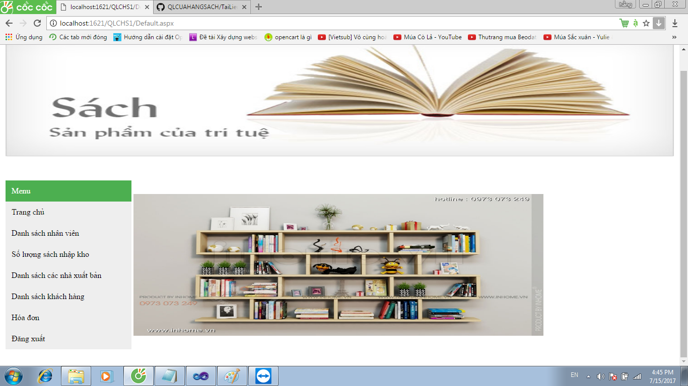
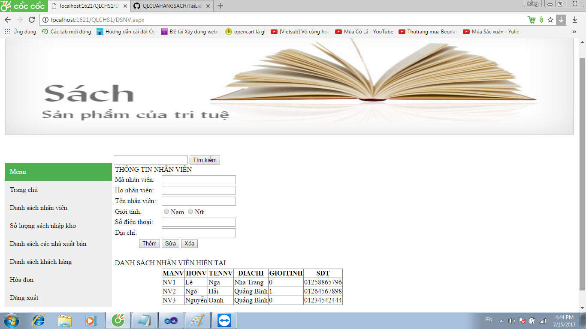
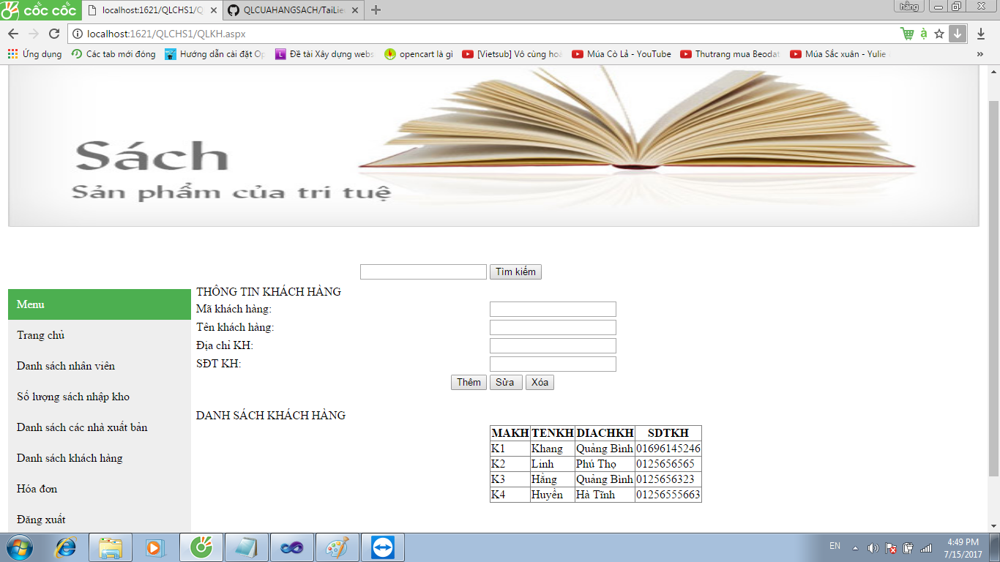
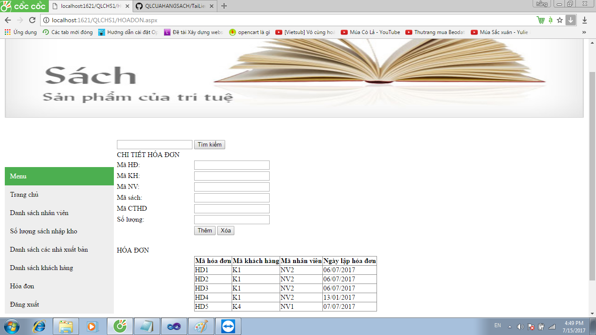
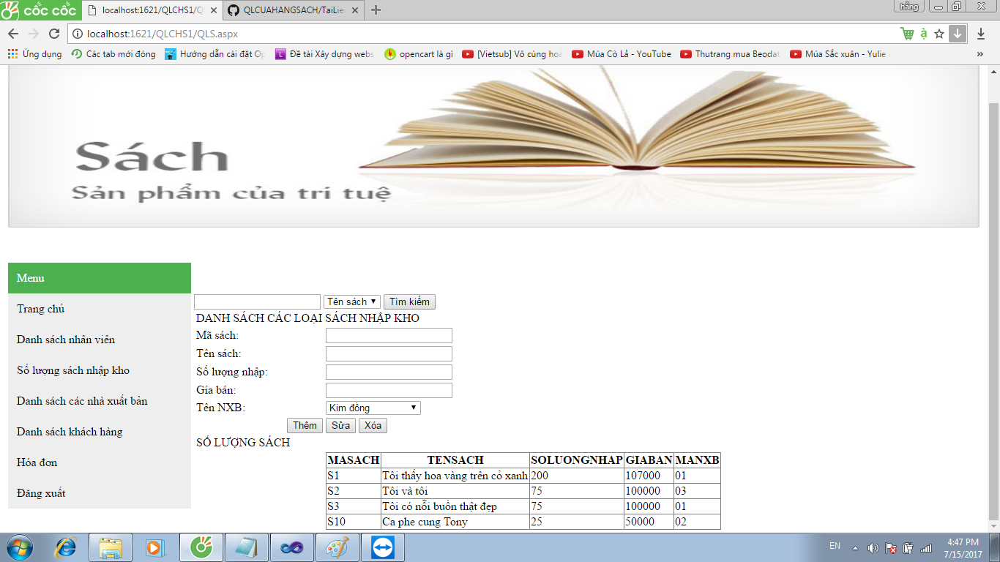
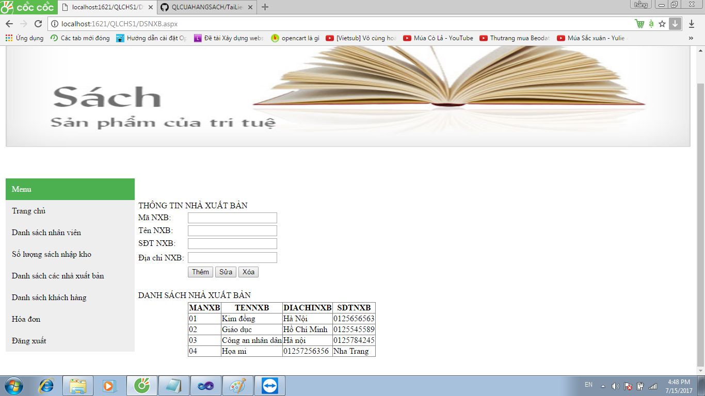

# Tài liệu cho người dùng cuối

Đây là hướng dẫn sử dụng trang Website cho người dùng

## 1) Giao diện chính
 

### Khi bạn mở Website sẽ đi tới trang đăng nhập
 

- Chức năng: Dùng để đăng nhập vào trang chủ của Website.  
- Hướng dẫn: Điền đầy đủ thông tin và nhấp vào nút đăng nhập. 

## 2) Trang chủ
 

### Sau khi đăng nhập thành công bạn sẽ vào giao diện chính của Website
 

- Chức năng: Là trang hiển thị sau khi chúng ta đăng nhập.  

## Sau đây là các chức năng của trang Website
 

## 3) Quản lý nhân viên
 

- Chức năng: Quản lý tất cả các nhân viên của cửa hàng,các bạn có thể Thêm/Sửa/Xóa thông tin các nhân viên. 
- Hướng dẫn:
  <ul>
    <li>Khi các bạn nhấp chuột vào chọn "Danh sách nhân viên" trong bảng Menu thì một trang mới sẽ hiện ra</li>
    <li>Sau đó phải nhập các thông tin ở các ô tương ứng.</li>
    <li>Click lựa chọn các nút chức năng muốn thực hiện.</li>
    <li>Các thông tin bạn vừa xử lý sẽ được hiển thị tại bảng DataGridView bên dưới.</li>
    <li>Các bạn cũng có thể tìm kiếm nhân viên theo tên bằng cách nhập tên nhân viên vào ô tìm kiếm và click vào nút tìm kiếm bên cạnh</li>
  </ul>
- Lưu ý: Khi sửa không được sửa mã nhân viên.

## 4) Quản lý khách hàng
 

- Chức năng: Quản lý các thông tin của khách hàng, bạn có thể Thêm/Sửa/Xóa thông tin của khách hàng. 
- Hướng dẫn:
  <ul>
    <li>Khi các bạn nhấp chuột vào chọn "Danh sách khách hàng" trong bảng Menu thì một trang mới sẽ hiện ra</li>
    <li>Nhập các thông tin của khách hàng ở các ô tương ứng</li>
    <li>Click lựa chọn các nút chức năng muốn thực hiện.</li>
    <li>Các thông tin bạn vừa xử lý sẽ được hiển thị tại bảng DataGridView bên cạnh.</li>
     <li>Các bạn cũng có thể tìm kiếm nhân viên theo tên bằng cách nhập tên khách hàng vào ô tìm kiếm và click vào nút tìm kiếm bên cạnh</li>
  </ul>
  
## 5) Quản lý hóa đơn
 

- Chức năng: Quản lý hóa đơn bán lẻ của cửa hàng. 
- Hướng dẫn:
  <ul>
    <li>Khi các bạn nhấp chuột vào chọn "Hóa đơn" trong bảng Menu thì một trang mới sẽ hiện ra</li>
    <li>Nhập các thông tin vào ô tương ứng</li>
    <li>Click lựa chọn các nút chức năng muốn thực hiện.</li>
    <li>Các thông tin bạn vừa xử lý sẽ được hiển thị tại bảng DataGridView bên cạnh.</li>
  </ul>
  
## 6) Quản lý số lượng sách nhập vào
 

- Chức năng: Quản lý số lượng sách nhập vào cửa hàng. 
- Hướng dẫn:
  <ul>
    <li>Khi các bạn nhấp chuột vào chọn "Số lượng sách nhập kho" trong bảng Menu thì một trang mới sẽ hiện ra</li>
    <li>Nhập các thông tin các ô tương ứng</li>
    <li>Click lựa chọn các nút chức năng muốn thực hiện.</li>
    <li>Các thông tin bạn vừa xử lý sẽ được hiển thị tại bảng DataGridView bên cạnh.</li>
    <li>Các bạn cũng có thể tìm kiếm sách theo tên hoặc mã sách bằng cách nhập tên hoặc mã sách vào ô tìm kiếm và lựa chọn kiểu tìm kiếm sau đó click vào nút tìm kiếm bên cạnh</li>
  </ul>
  
## 7) Quản lý nhà xuất bản
 

- Chức năng: Tìm kiếm nhà xuất bản có sách tại cửa hàng. 
- Hướng dẫn:
  <ul>
    <li>Khi các bạn nhấp chuột vào chọn "Danh sách các nhà xuất bản" trong bảng Menu thì một trang mới sẽ hiện ra</li>
    <li>Nhập các thông tin các ô tương ứng</li>
    <li>Click lựa chọn các nút chức năng muốn thực hiện.</li>
    <li>Các thông tin bạn vừa xử lý sẽ được hiển thị tại bảng DataGridView bên cạnh.</li>
  </ul>
  
## 8) Đăng xuất
 
- Chức năng: Để quay về trang Đăng nhập. 
- Hướng dẫn: 
  <ul>
    <li>Khi các bạn nhấp chuột vào chọn "Đăng xuất" trong bảng Menu thì sẽ quay về trang đăng nhập</li>
  </ul>
